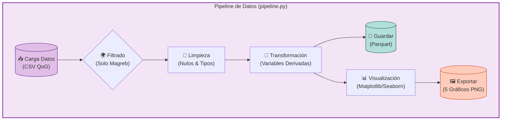

# Trabajo Final: Pipeline de Big Data con Infraestructura Docker

**Alumno:** Carlos Rivasplata  
**Docente:** Juan Marcelo Gutiérrez  
**Curso:** ESPECIALISTA EN BIG DATA

**🚀 Ver Dashboard Interactivo:** [https://carlosrivasplata.github.io/ejercicios-bigdata/](https://carlosrivasplata.github.io/ejercicios-bigdata/)

---

## Tema de Investigación

**Título:** Desarrollo Político-Económico en el Magreb: Autoritarismo vs Democracia

**Pregunta de Investigación:**
¿Existe una relación directa entre el desarrollo económico (PIB per cápita) y el nivel de democracia electoral en los países del Magreb? ¿Los países más ricos de la región tienden a ser más democráticos o el autoritarismo persiste independientemente de la riqueza?

---

## Selección de Datos

### 1. Fuente de Datos: The Quality of Government (QoG) Institute

Para este análisis, se ha seleccionado el **Standard Dataset (Cross-Section)** del **QoG Institute** de la Universidad de Gotemburgo. Esta fuente de datos es una de las más completas y respetadas en ciencias sociales, ya que agrega y estandariza cientos de variables de fuentes primarias (como el Banco Mundial, V-Dem, Freedom House, etc.) en un único dataset coherente.

Su uso es ideal para este proyecto porque permite comparar países a través de múltiples dimensiones (política, economía, desarrollo social) utilizando indicadores estandarizados y validados académicamente.

### 2. Países (Región Magreb)
He seleccionado los 5 países principales del Magreb debido a su relevancia geopolítica y sus diferentes trayectorias tras la Primavera Árabe:

1.  **Marruecos (MAR):** Monarquía constitucional.
2.  **Argelia (DZA):** República presidencialista con fuerte influencia militar.
3.  **Túnez (TUN):** Única democracia emergente tras 2011 (aunque en retroceso reciente).
4.  **Libia (LBY):** Estado fragmentado tras la guerra civil.
5.  **Mauritania (MRT):** República islámica en transición.

### 3. Variables Seleccionadas

| Variable | Código QoG | Descripción |
|----------|------------|-------------|
| **Democracia** | `vdem_polyarchy` | Índice de democracia electoral de V-Dem (0=Autocracia, 1=Democracia). |
| **Economía** | `wdi_gdppc` | PIB per cápita (USD constantes). Indicador de desarrollo económico. |
| **Corrupción** | `ti_cpi` | Índice de Percepción de la Corrupción (Transparency Int.). |
| **Estabilidad** | `wgi_pv` | Estabilidad política y ausencia de violencia/terrorismo. |
| **Social** | `undp_hdi` / `wdi_lifexp` | Índice de Desarrollo Humano o Esperanza de Vida. |

---

## Metodología y Selección de Modelo

1.  **Infraestructura:** Cluster Docker con Spark Master, Worker y PostgreSQL.
2.  **ETL:** Procesamiento con PySpark para filtrar países, limpiar nulos y generar variables derivadas.
3.  **Selección de Modelo de Análisis:**
    El enunciado del trabajo final propone tres enfoques metodológicos posibles:
    1.  **Series Temporales (Panel Data):** Para analizar la evolución a lo largo del tiempo (ej. Test de Hausman).
    2.  **Clustering (K-Means):** Para agrupar países según similitudes.
    3.  **Análisis Comparativo:** Para contrastar indicadores entre países o grupos.

    Dado que el dataset QoG utilizado es de tipo **Cross-Section** (una "fotografía" de un único año reciente) y la muestra se limita a 5 países del Magreb:

    *   Se **descarta** el enfoque de **Series Temporales**, ya que no existe la dimensión temporal necesaria en los datos.
    *   Se **descarta** el enfoque de **Clustering**, ya que 5 observaciones son insuficientes para generar un agrupamiento estadístico robusto.

    Por lo tanto, se ha seleccionado el **Análisis Comparativo y Correlacional** como el modelo más adecuado y riguroso para responder a la pregunta de investigación con los datos disponibles.

---

## Arquitectura del Sistema

### Diagrama de Infraestructura (Docker)

```mermaid
graph TD
    subgraph Host_Machine ["Tu Computadora (Host)"]
        CSV[("📂 Datos CSV (QoG)")]
        Code["📜 pipeline.py"]
        Output_Local["📂 outputs/ (Gráficos)"]
    end

    subgraph Docker_Environment ["🐳 Docker Compose Cluster"]
        direction TB
        
        subgraph Spark_Cluster ["Apache Spark Cluster"]
            Master["🧠 Spark Master<br>(Puerto 8080)"]
            Worker["💪 Spark Worker<br>(2GB RAM, 2 Cores)"]
        end
        
        Postgres[("🐘 PostgreSQL<br>(Puerto 5432)")]
    end

    %% Conexiones de Volúmenes
    CSV -.-> |Volumen /workspace/datos| Master
    Code -.-> |Volumen /workspace/src| Master
    
    %% Flujo de Datos
    Master --> |Asigna Tareas| Worker
    Worker --> |Procesa Datos| Master
    Master --> |Guarda Resultados| Output_Local
    Master -.-> |Conexión JDBC (Opcional)| Postgres

    %% Estilos
    style Host_Machine fill:#f9f9f9,stroke:#333,stroke-width:2px
    style Docker_Environment fill:#e1f5fe,stroke:#0277bd,stroke-width:2px
    style Spark_Cluster fill:#fff3e0,stroke:#ef6c00,stroke-width:2px
    style Master fill:#ffcc80,stroke:#ef6c00
    style Worker fill:#ffe0b2,stroke:#ef6c00
    style Postgres fill:#b2dfdb,stroke:#00695c
```

### Diagrama de Flujo del Pipeline (ETL)



---

## Ejecución

Para reproducir este análisis:

1.  Levantar la infraestructura: `docker compose up -d`
2.  Ejecutar el pipeline completo: `docker compose exec spark-master /opt/spark/bin/spark-submit /workspace/pipeline.py`
3.  Ver los resultados: Los gráficos generados se encontrarán en la carpeta `outputs/graficos`.
