# Arquitectura de Infraestructura Big Data con Docker

## 1. Diagrama de Arquitectura

El siguiente diagrama ilustra la interacción entre los componentes del sistema, incluyendo el flujo de datos desde el host local hacia el cluster de Spark y la persistencia final en PostgreSQL.

```mermaid
%%{init: {'theme': 'base', 'themeVariables': { 'primaryColor': '#ffffff', 'edgeLabelBackground':'#ffffff', 'tertiaryColor': '#ffffff', 'mainBkg': '#ffffff', 'nodeBorder': '#000000', 'lineColor': '#000000', 'fontFamily': 'arial', 'fontSize': '14px'}}}%%
graph TD
    subgraph Host_Machine ["Tu Computadora (Host)"]
        CSV[("📂 Datos CSV (QoG)")]
        Code["📜 pipeline.py"]
        Output_Local["📂 outputs/ (Gráficos)"]
    end

    subgraph Docker_Environment ["🐳 Docker Compose Cluster"]
        direction TB
        
        subgraph Spark_Cluster ["Apache Spark Cluster"]
            Master["🧠 Spark Master<br>(Puerto 8080)"]
            Worker["💪 Spark Worker<br>(2GB RAM, 2 Cores)"]
        end
        
        Postgres[("🐘 PostgreSQL<br>(Puerto 5432)")]
    end

    %% Conexiones de Volúmenes
    CSV -.-> |Volumen /workspace/datos| Master
    Code -.-> |Volumen /workspace/src| Master
    
    %% Flujo de Datos (Flechas gruesas)
    Master ==> |Asigna Tareas| Worker
    Worker ==> |Procesa Datos| Master
    Master ==> |Guarda Resultados| Output_Local
    Master -.-> |"Conexión JDBC (Persistencia)"| Postgres

    %% Estilos Globales Profesionales
    classDef default fill:#fff,stroke:#000,stroke-width:2px,color:#000;
    classDef cluster fill:#fff,stroke:#000,stroke-width:2px,color:#000,stroke-dasharray: 5 5;
    class Host_Machine,Docker_Environment,Spark_Cluster cluster;
```



## 2. Descripción General

Esta infraestructura despliega un **cluster de procesamiento de Big Data** utilizando contenedores Docker. El objetivo es crear un entorno aislado y reproducible para ejecutar tareas de ETL y análisis con Apache Spark. El cluster consta de tres servicios principales: un nodo maestro de Spark (Master), un nodo trabajador (Worker) y una base de datos PostgreSQL para persistencia de datos relacionales. Todo el conjunto se orquesta mediante Docker Compose, permitiendo levantar y detener el entorno con un solo comando.

## 3. Servicios

### 3.1 PostgreSQL
- **Imagen:** `postgres:16-alpine` (Versión ligera basada en Alpine Linux).
- **Función:** Actuar como almacén de datos persistente (Data Warehouse) para los resultados refinados del pipeline.
- **Configuración clave:**
    - **Puertos:** Expone el puerto `5432` del contenedor al puerto `5432` de la máquina local (host), permitiendo conexiones desde herramientas externas como DBeaver o pgAdmin.
    - **Volúmenes:** Utiliza un volumen nombrado `postgres_data` para persistir los datos de la base de datos incluso si el contenedor se destruye.
    - **Healthcheck:** Implementa un comando `pg_isready` para verificar que la base de datos esté lista para aceptar conexiones antes de dar el servicio por iniciado.

### 3.2 Spark Master
- **Imagen:** `apache/spark:3.5.4-python3`
- **Función:** Es el cerebro del cluster. Se encarga de coordinar los recursos, programar las aplicaciones y distribuir las tareas entre los workers disponibles.
- **Puertos:**
    - `7077`: Puerto interno para la comunicación entre el Master y los Workers (o drivers externos).
    - `8080`: Puerto para la Interfaz Web (Spark UI), accesible desde el navegador para monitorear el estado del cluster y los trabajos en ejecución.

### 3.3 Spark Worker
- **Imagen:** `apache/spark:3.5.4-python3`
- **Función:** Es el músculo del cluster. Ejecuta las tareas de cómputo (Tasks) que le asigna el Master y reporta el estado y los resultados.
- **Recursos:**
    - **Memoria:** Limitada a `2GB` (`SPARK_WORKER_MEMORY=2g`) para asegurar un rendimiento estable en entornos de desarrollo locales.
    - **Cores:** Configurado para usar `2` núcleos de CPU (`SPARK_WORKER_CORES=2`), permitiendo paralelismo en la ejecución de tareas.
- **Conexión:** Se conecta al Master utilizando la URL `spark://spark-master:7077`.

## 4. Volúmenes y Redes

La configuración de volúmenes es crítica para este proyecto, ya que permite la interacción fluida entre el código en desarrollo y el entorno de ejecución en Docker.

**Mapeo de Volúmenes (`volumes`):**
- `./datos:/workspace/datos`: Permite que Spark lea los datasets (CSV) descargados en tu máquina local.
- `./src:/workspace/src`: Mapea el código fuente, permitiendo editar scripts en tu IDE y ejecutarlos en el contenedor sin reconstruir la imagen.
- `./outputs:/workspace/outputs`: Asegura que los resultados (archivos Parquet, gráficos PNG) generados por Spark se guarden directamente en tu disco duro local.
- `./pipeline.py:/workspace/pipeline.py`: Monta el script principal de ejecución.
- `./requirements.txt:/workspace/requirements.txt`: Permite instalar las dependencias de Python exactas dentro del contenedor.

## 5. Ejecución y Escalabilidad

Para permitir la persistencia en PostgreSQL, el pipeline requiere el driver JDBC `org.postgresql:postgresql:42.6.0`. Este driver no viene incluido en la imagen base de Spark, por lo que se descarga dinámicamente en tiempo de ejecución.

**Comando de Ejecución Final:**
```sh
docker compose exec -u 0 spark-master /opt/spark/bin/spark-submit --packages org.postgresql:postgresql:42.6.0 /workspace/pipeline.py
```

Este comando:
1.  Ejecuta como `root` (`-u 0`) para permitir la escritura en carpetas temporales de caché (`.ivy2`).
2.  Usa `--packages` para descargar el driver de Postgres desde Maven Central.
3.  Ejecuta el script `pipeline.py` que realiza el ETL y guarda los datos.

---

## 6. Evidencias de Ejecución

### Captura de Pantalla (Spark UI)
Estado del cluster durante la ejecución del pipeline:


### Verificación de Datos en PostgreSQL
Consulta SQL realizada directamente en el contenedor para verificar la persistencia de los datos:

